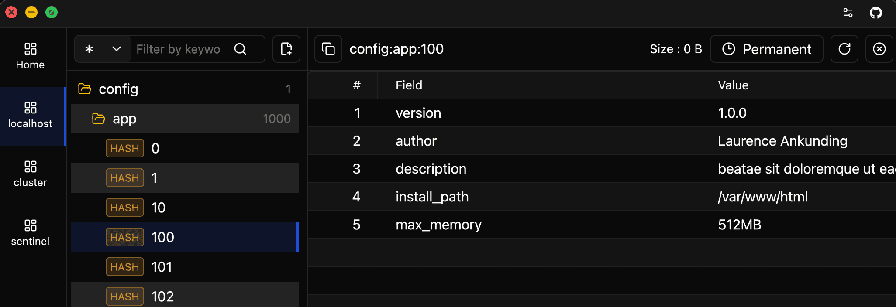

# Zedis

A High-Performance, GPU-Accelerated Redis Client Built with **Rust** 🦀 and **GPUI** ⚡️

---

## 📖 Introduction

**Zedis** is a next-generation Redis GUI client designed for developers who demand speed. 

Unlike Electron-based clients that can feel sluggish with large datasets, Zedis is built on **GPUI** (the same rendering engine powering the [Zed Editor](https://zed.dev)). This ensures a native, 60 FPS experience with minimal memory footprint, even when browsing millions of keys.

## ✨ Features

### 🚀 Blazing Fast
- **GPU Rendering**: All UI elements are rendered on the GPU for buttery smooth performance.
- **Virtual List**: Efficiently handle lists with 100k+ keys using virtual scrolling and `SCAN` iteration.

### 🧠 Smart Data Viewer
Zedis automatically detects content types (`ViewerMode::Auto`) and renders them in the most useful format:
- **Automatic Decompression**: Transparently detects and decompresses **GZIP** and **ZSTD** data, allowing you to view the actual content (e.g., compressed JSON will be automatically unpacked and pretty-printed).
- **JSON**: Automatic **pretty-printing** with full **syntax highlighting** for better readability.
- **MessagePack**: deserializes binary MsgPack data into a readable JSON-like format.
- **Images**: Native preview for stored images (`PNG`, `JPG`, `WEBP`, `SVG`, `GIF`).
- **Hex View**: Adaptive 8/16-byte hex dump for analyzing raw binary data.
- **Text**: UTF-8 validation with large text support.

### 🎨 Modern Experience
- **Cross-Platform**: Powered by GPUI, Zedis delivers a consistent, high-performance native experience across **macOS**, **Windows**, and **Linux**.
- **Smart Topology Detection**: Automatically identifies and adapts to **Standalone**, **Cluster**, or **Sentinel** modes. Just connect to an entry node, and Zedis handles the topology mapping without complex configuration.
- **Themes**: Pre-loaded with **Light**, **Dark**, and **System** themes.
- **I18n**: Full support for **English** and **Chinese (Simplified)**.
- **Responsive**: Split-pane layout that adapts to any window size.

## 📄 License

This project is Licensed under [Apache License, Version 2.0](./LICENSE).